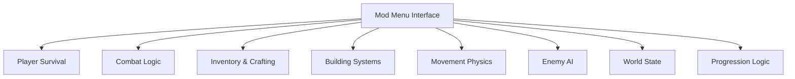

## Overview

Len’s Island Mod Menu is a centralized runtime control interface built to manage and customize sandbox systems within **Len’s Island**. The mod menu exposes adjustable parameters for player survival mechanics, combat behavior, resource flow, construction validation, enemy encounters, and global simulation rules. Operating as a non-destructive overlay, it applies real-time overrides to internal calculations without permanently modifying save data or core assets. Secondary keywords integrated include Len’s Island mod menu, survival sandbox editor, crafting controller, and world management utility.

---

## Player Survival and Vitality Controls

* Health and stamina lock
* Damage scaling and immunity toggles
* Regeneration rate adjustment
* Hunger and thirst suppression

**Feature intent:**
Overrides survival-state calculations to stabilize player condition during exploration, combat, and dungeon runs.

---

## Combat and Weapon System Management

* Damage output multiplier
* Attack speed and cooldown adjustment
* Weapon durability bypass
* Knockback and hit response tuning

**In-game behavior:**
Modifies combat resolution logic while preserving weapon acquisition and progression flow.

---

## Resource, Inventory, and Crafting Editor

* Unlimited item usage
* Crafting material requirement bypass
* Instant crafting execution
* Inventory quantity adjustment

**Feature intent:**
Intercepts inventory validation checks to streamline crafting, upgrades, and experimentation.

---

## Building and Construction Controls

* Free build mode (no resource cost)
* Placement collision bypass
* Instant structure completion
* Upgrade and blueprint requirement override

**In-game behavior:**
Adjusts building rules and placement validation for rapid base construction and redesign.

---

## Movement, Physics, and Traversal Settings

* Movement speed multiplier
* Jump height and gravity tuning
* Fall damage disable
* Swim and climb stamina bypass

**Feature intent:**
Applies physics-layer overrides to traversal across islands, caves, and vertical environments.

---

## Enemy AI and Encounter Regulation

* Enemy freeze and speed scaling
* Spawn rate and density adjustment
* Aggression radius tuning
* Boss phase control

**In-game behavior:**
Influences enemy update loops and encounter pacing to regulate difficulty.

---

## World State and Time Management

* Time freeze and speed scaling
* Weather and event override
* Day/night cycle adjustment
* Dungeon and area reset control

**Feature intent:**
Manages global simulation variables that affect pacing, visibility, and world events.

---

## Progression and Unlock Management

* Instant skill and recipe unlocks
* Experience gain multiplier
* Upgrade requirement bypass
* Quest condition override

**In-game behavior:**
Alters progression validation logic governing skills, crafting tiers, and objectives.

---

## Mod Menu Interface and Runtime Control

* Categorized feature modules
* Toggle-based real-time activation
* Adjustable sliders and hotkeys
* Session-scoped configuration

**Feature intent:**
Acts as the central coordination layer, synchronizing all mod menu systems dynamically during gameplay.

---

## System Architecture Diagram

---

## FAQ

**Does the mod menu permanently modify save files?**
No, all changes are applied at runtime only.

**Can individual systems be toggled independently?**
Yes, each module operates separately.

**Are changes applied instantly?**
Most adjustments take effect in real time.

**Does it affect bosses and dungeon encounters?**
Enemy AI behavior and boss phases can be regulated.

**Can progression changes be reversed?**
Disabling progression features restores default behavior.

**Is configuration saved between sessions?**
Settings apply per active session.

---

## Feature Summary

* Player survival and vitality controls
* Combat and weapon system management
* Resource, inventory, and crafting editor
* Building and construction controls
* Movement, physics, and traversal settings
* Enemy AI and encounter regulation
* World state and time management
* Progression and unlock management
* Centralized Len’s Island mod menu interface
